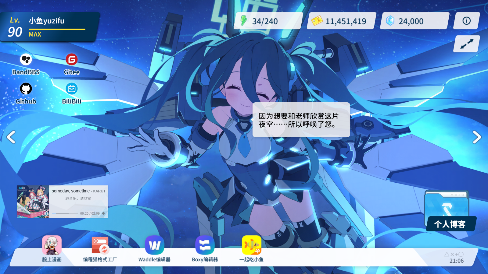
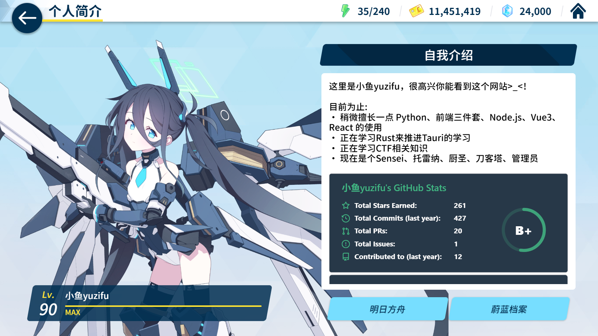

<p align="center">
  <a href="./README.md">简体中文</a> | <a href="./README_EN.md">English</a>
</p>

<h1 align="center">小鱼档案</h1>

<p align="center">
  <a href='https://gitee.com/sf-yuzifu/homepage/stargazers'></a>
  <a href='https://gitee.com/sf-yuzifu/homepage/members'></a>
  <a href='https://github.com/sf-yuzifu/homepage/stargazers'></a>
  <a href='https://github.com/sf-yuzifu/homepage/forks'></a>
</p>

<div align="center">有关小鱼的《蔚蓝档案》风格的个人主页</div>





## 预览链接

- [小鱼档案](https://yzf.moe)
- [小鱼档案 - 备用](https://yuzifu.top/)

## 目前复刻程度

- [x] 加载界面
- [x] 主界面复刻
- [x] 回忆大厅
- [x] 弹窗复刻
- [x] 什亭之箱转场
- [x] 点击特效和动效
- [x] 多个学生回忆大厅l2d切换
- [x] 学生回忆大厅全局观赏
- [x] 学生摸头和对话互动
- [x] i18n适配
- [x] 个人信息等二级界面

## 使用到的项目

- [Vue](https://cn.vuejs.org/)
- [Vite](https://vitejs.cn/vite3-cn/)
- [Arco Design](https://arco.design/)
- [PIXIjs](https://github.com/pixijs/pixijs)
- [spine-pixi-v7](https://www.npmjs.com/package/@esotericsoftware/spine-pixi-v7)
- [Iconfont](https://www.iconfont.cn/)
- [cn-font-split](https://github.com/KonghaYao/cn-font-split)
- [APlayer](https://aplayer.js.org/#/)
- [howler.js](https://github.com/goldfire/howler.js)
- [Resource Han Rounded CN](https://github.com/CyanoHao/Resource-Han-Rounded)

## 部署方式

### 使用第三方部署平台

#### 1. Vercel
[](https://vercel.com/import/project?template=https://github.com/sf-yuzifu/homepage)

#### 2. Netlify
1. `Fork`[本项目](https://github.com/sf-yuzifu/homepage)
2. [登录 Netlify 控制台](https://app.netlify.com )，选择`Add new site`-`Import an exist project`添加网站
3. 接着选择 GitHub 认证来读取我们的 GitHub 项目列表。在列表中搜索我们刚才`Fork`生成的仓库名，点击该项目开始基于该仓库创建我们的 Netlify 网站

### 本地构建网页文件

> **推荐环境：**
>
> node > 18.0.0  
> npm > 8.15.0

1. 安装yarn

```bash
# 安装 yarn
npm install -g yarn
```

2. 克隆此项目到本地
3. 在项目根目录下运行

```bash
# 安装依赖
yarn install

# 预览（开发环境）
yarn dev

# 构建
yarn build

# 预览（生产环境预览）
yarn preview
```

> 构建完成后，静态资源会在 **`dist` 目录** 中生成，你可以将 **`dist` 目录中的文件**上传至服务器

> 其中关于宝塔如何部署的（[https://cloud.tencent.com/developer/article/1977167](https://cloud.tencent.com/developer/article/1977167)）

## 个性化

> 新版本配置文件采用yaml格式以方便阅读，想要快速迁移可以通过[此网站](https://www.json.cn/json2yaml/)快速将json格式转为yaml格式
> 
> 打开根目录下的 `_config.yaml`，在其中你会看到如下内容

```yaml
# 网站基本配置
title: Fish Archive # 网站标题 - 浏览器标签页显示的标题
description: A personal homepage in Blue Archive style. # 网站描述 - 用于搜索引擎优化和社交媒体分享
favicon: /favicon144.png # 网站图标路径 - 浏览器标签页显示的小图标
author: Yuzifu # 网站作者姓名
keywords: 'Blue Archive, 小鱼yuzifu, Personal Homepage' # 网站关键词 - 用于搜索引擎优化，逗号分隔
# ICP备案号 - 中国大陆备案信息，留空表示未备案
ICP: ''
# 公安备案号 - 中国大陆网站备案信息，留空表示未备案
gongan: ''

# PWA配置 - 渐进式Web应用配置（https://developer.mozilla.org/zh-CN/docs/Web/Manifest）
manifest:
  name: Fish Archive # PWA应用完整名称
  short_name: Fish Archive # PWA应用简短名称 - 用于桌面显示
  description: A personal homepage in Blue Archive style. # PWA应用描述
  theme_color: '#128AFA' # PWA主题颜色 - 影响浏览器UI颜色
  start_url: / # PWA启动URL - 应用启动时打开的页面
  id: Homepage # PWA应用唯一标识符
  # PWA图标配置
  icons:
    # 大尺寸图标 - 用于桌面安装
    - src: /favicon512.png
      sizes: 512x512
      purpose: any maskable
    # 小尺寸图标 - 用于移动设备
    - src: /favicon144.png
      sizes: 144x144

# 个人游戏等级信息
level: 90  # 当前等级
exp: 8382   # 当前经验值
nextExp: 8381  # 升级所需经验值

# Iconfont字体库地址 - 阿里云图标字体库
iconfont: 'https://at.alicdn.com/t/c/font_4336463_0i6ly0yvyzb.js'

# 底部项目展示区域 - 显示相关项目链接（推荐5个）
dock:
  # 项目1
  - name: Fish Archive Project
    href: 'https://gitee.com/sf-yuzifu/eat-fish-together'
    imgSrc: /img/fish.png

# 左侧联系方式区域（推荐4个）
contact:
  # 联系方式1
  - name: Github Profile
    href: 'https://github.com/sf-yuzifu'
    iconfont: icon-github

# 任务按钮配置 - 页面左下角的任务按钮
task:
  # 任务按钮显示文本
  name: Blog Link
  # 任务按钮链接地址
  href: 'https://blog.yzf.moe/'

# Banner音乐播放器配置
banner:
  # 网易云音乐歌曲ID列表 - 用于随机播放
  musicID:
    - 2059151619

# Live2D角色配置
memorialLobbies:
  # 角色1 - Aris
  - name: Aris
    # Live2D模型文件路径
    path: '/l2d/aris/'
    # 骨骼动画文件
    skel: 'Aris_home.skel'
    # 纹理图集文件
    atlas: 'Aris_home.atlas'
    # 角色在屏幕中的水平位置偏移（0-1之间）
    offset: 0.45
    # 对话框显示位置配置
    dialogueDisplay:
      # X坐标位置（可以是分数）
      x: -1/4 - 1/16
      # Y坐标位置（可以是分数）
      y: -1/16
      # 对话框位置（left/right）
      position: right

bio:
  student:
    - name: CH0334_spr
      # Live2D模型文件路径
      path: '/l2d/CH0334_spr/'
      # 骨骼动画文件
      skel: 'CH0334_spr.skel'
      # 纹理图集文件
      atlas: 'CH0334_spr.atlas'
  bth:
  - name: 蔚蓝档案
    path: /img/card/ba.png
  - name: 明日方舟
    path: /img/card/arknight.png
```
> 修改其中相关内容，之后重新按上述方式部署即可完成修改

## 有关i18n
本项目支持多语言国际化，其中`简体中文`为本项目默认语言，位于`_config.yaml`中，并内置了`English`、`日本語`和`繁體中文`，分别位于`src/locales/en-US.yaml`、`src/locales/ja-JP.yaml`和`src/locales/zh-TW.yaml`。

### 翻译文件目录结构
```
src/locales/
├── zh-CN.yaml  # 简体中文翻译文件
├── zh-TW.yaml  # 繁体中文翻译文件
├── en-US.yaml  # 英文翻译文件
└── ja-JP.yaml  # 日文翻译文件
```

### 翻译文件配置项
以`src/locales/zh-CN.yaml`为例，翻译文件包含以下配置项：
```yaml
# 网站标题、描述和关键词
title: 网站标题
description: 网站描述
keywords: 关键词列表

# PWA配置
manifest:
  name: PWA应用名称
  short_name: PWA应用短名
  description: PWA应用描述

# 作者名称
author: 作者名称

# 底部项目展示区域
dock:
  - name: 项目名称

# 左侧联系方式区域
contact:
  - name: 联系方式名称

# 任务按钮配置
task:
  name: 任务按钮显示文本

# 纪念大厅角色显示名称
memorialLobbies:
  - name: 角色名称

# 角色语音对话翻译
memorialLobbies[0]:
  voice:
    对话键: 对话内容

# 通用界面翻译字符串
translate:
  about: 关于
  projectWebsite: 项目地址：
  info: 通知
  ifSkip: 是否跳过？
  update: 站点更新提示
  ok: 确认
  cancel: 取消
  bio: 个人简介
  bioTitle: 自我介绍
  bioContent:
    - 这里是小鱼yuzifu，很高兴你能看到这个网站>_<！
    - <br/>
  prevPage: 上一页
  nextPage: 下一页

bio:
  bth:
  - name: 蔚蓝档案
  - name: 明日方舟
```

## 有关学生回忆大厅L2D文件获取

1. 自己去游戏解包中获取
2. 去[基沃托斯古书馆](https://kivo.fun/)中的`角色图鉴`—`切换到鉴赏模式`—`回忆大厅`当中自行抓包获取

## 基于本项目的最佳实践

> 感谢使用此项目的大佬们能够进一步完善这个项目😭😭😭
> 
> 欢迎其他大佬通过Issue来向我投稿最佳实践❤❤❤

1. [Home - 杏仁レモンティー](https://apricotlemontea.com/)
2. [ElectroHeavenVN's Homepage](https://electroheavenvn.github.io/homepage/)
