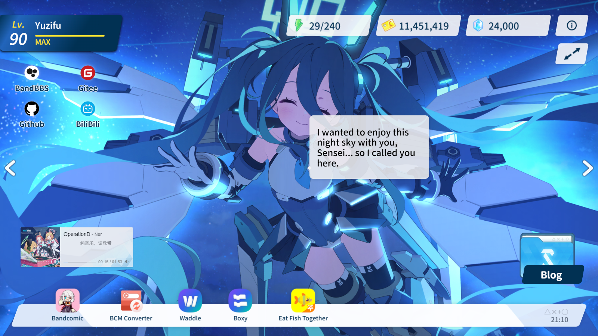
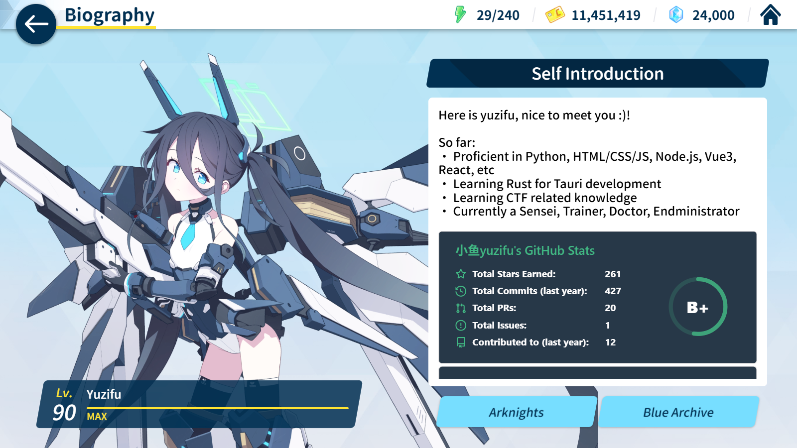

<p align="center">
  <a href="./README.md">简体中文</a> | <a href="./README_EN.md">English</a>
</p>

<h1 align="center">Fish Archive</h1>

<p align="center">
  <a href='https://gitee.com/sf-yuzifu/homepage/stargazers'></a>
  <a href='https://gitee.com/sf-yuzifu/homepage/members'></a>
  <a href='https://github.com/sf-yuzifu/homepage/stargazers'></a>
  <a href='https://github.com/sf-yuzifu/homepage/forks'></a>
</p>

<div align="center">A Blue Archive-style personal homepage for me.</div>




## Preview Links

- [Fish Archive](https://yzf.moe)
- [Fish Archive - Backup](https://yuzifu.top/)

## Current Implementation Status

- [x] Loading screen
- [x] Main interface recreation
- [x] Memorial lobby
- [x] Popup recreation
- [x] Shittim Chest transition
- [x] Click effects and animations
- [x] Multiple student memorial lobby L2D switching
- [x] Student memorial lobby global viewing
- [x] Student head-patting and dialogue interactions
- [x] i18n support
- [x] Personal information and other secondary interfaces

## Projects Used

- [Vue](https://vuejs.org/)
- [Vite](https://vitejs.dev/)
- [Arco Design](https://arco.design/)
- [PIXIjs](https://github.com/pixijs/pixijs)
- [spine-pixi-v7](https://www.npmjs.com/package/@esotericsoftware/spine-pixi-v7)
- [Iconfont](https://www.iconfont.cn/)
- [cn-font-split](https://github.com/KonghaYao/cn-font-split)
- [APlayer](https://aplayer.js.org/#/)
- [howler.js](https://github.com/goldfire/howler.js)
- [Resource Han Rounded CN](https://github.com/CyanoHao/Resource-Han-Rounded)

## Deployment Methods

### Using Third-Party Deployment Platforms

#### 1. Vercel
[](https://vercel.com/import/project?template=https://github.com/sf-yuzifu/homepage)

#### 2. Netlify
1. `Fork` [this project](https://github.com/sf-yuzifu/homepage)
2. [Log in to Netlify Console](https://app.netlify.com), select `Add new site` - `Import an exist project` to add a website
3. Then select GitHub authentication to read our GitHub project list. Search for the repository name we just `Fork`ed in the list, click on the project to start creating our Netlify website based on that repository

### Local Build

> **Recommended Environment:**
>
> node > 18.0.0  
> npm > 8.15.0

1. Install yarn

```bash
# Install yarn
npm install -g yarn
```

2. Clone this project to your local machine
3. Run the following commands in the project root directory

```bash
# Install dependencies
yarn install

# Preview (development environment)
yarn dev

# Build
yarn build

# Preview (production environment preview)
yarn preview
```

> After the build is complete, static resources will be generated in the **`dist` directory**. You can upload the **files in the `dist` directory** to your server.

> For how to deploy on BtPanel ([https://cloud.tencent.com/developer/article/1977167](https://cloud.tencent.com/developer/article/1977167))

## Customization

> The new version configuration file uses YAML format for easy reading. For quick migration, you can use [this website](https://www.json.cn/json2yaml/) to quickly convert JSON format to YAML format.
> 
> Open `_config.yaml` in the root directory, where you will see the following content:

```yaml
# Website Basic Configuration
title: Fish Archive # Website title - displayed in browser tab
description: A personal homepage in Blue Archive style. # Website description - used for SEO and social media sharing
favicon: /favicon144.png # Website icon path - small icon displayed in browser tab
author: Yuzifu # Website author name
keywords: 'Blue Archive, Xiaoyu yuzifu, Personal Homepage' # Website keywords - used for SEO, comma-separated
ICP: '' # ICP number -  China registration number, empty if not registered or you're not in China
gongan: '' # Public Security Registration Number - China registration number, empty if not registered or you're not in China

# PWA Configuration - Progressive Web App configuration (https://developer.mozilla.org/en-US/docs/Web/Manifest)
manifest:
  name: Fish Archive # PWA app full name
  short_name: Fish Archive # PWA app short name - used for desktop display
  description: A personal homepage in Blue Archive style. # PWA app description
  theme_color: '#128AFA' # PWA theme color - affects browser UI color
  start_url: / # PWA start URL - page opened when app launches
  id: Homepage # PWA app unique identifier
  # PWA icon configuration
  icons:
    # Large icon - used for desktop installation
    - src: /favicon512.png
      sizes: 512x512
      purpose: any maskable
    # Small icon - used for mobile devices
    - src: /favicon144.png
      sizes: 144x144

# Personal game level information
level: 90  # Current level
exp: 8382   # Current experience points
nextExp: 8381  # Experience points needed to level up

# Iconfont font library address - Alibaba Cloud icon font library
iconfont: 'https://at.alicdn.com/t/c/font_4336463_0i6ly0yvyzb.js'

# Bottom project showcase area - display related project links (recommended 5)
dock:
  # Project 1
  - name: Fish Archive Project
    href: 'https://gitee.com/sf-yuzifu/eat-fish-together'
    imgSrc: /img/fish.png

# Left contact information area (recommended 4)
contact:
  # Contact 1
  - name: Github Profile
    href: 'https://github.com/sf-yuzifu'
    iconfont: icon-github

# Task button configuration - task button at the bottom left of the page
task:
  # Task button display text
  name: Blog Link
  # Task button link address
  href: 'https://blog.yzf.moe/'

# Banner music player configuration
banner:
  # NetEase Cloud Music song ID list - used for random playback
  musicID:
    - 2059151619

# Live2D Character Configuration
memorialLobbies:
  # Character 1 - Aris
  - name: Aris
    # Live2D model file path
    path: '/l2d/aris/'
    # Skeleton animation file
    skel: 'Aris_home.skel'
    # Texture atlas file
    atlas: 'Aris_home.atlas'
    # Character horizontal position offset on screen (between 0-1)
    offset: 0.45
    # Dialogue box display position configuration
    dialogueDisplay:
      # X coordinate position (can be a fraction)
      x: -1/4 - 1/16
      # Y coordinate position (can be a fraction)
      y: -1/16
      # Dialogue box position (left/right)
      position: right

# Bio page configuration
bio:
  student:
    - name: CH0334_spr
      # Live2D model file path
      path: '/l2d/CH0334_spr/'
      # Skeleton animation file
      skel: 'CH0334_spr.skel'
      # Texture atlas file
      atlas: 'CH0334_spr.atlas'
  bth:
    - name: Blue Archive
      path: /img/card/ba.png
    - name: Arknights
      path: /img/card/arknight.png
```
> Modify the relevant content, then redeploy according to the above methods to complete the modification.

## About i18n
This project supports multilingual internationalization, with `Simplified Chinese` as the default language, located in `_config.yaml`. Built-in languages include `English`, `日本語`, and `繁體中文`, located in `src/locales/en-US.yaml`, `src/locales/ja-JP.yaml`, and `src/locales/zh-TW.yaml` respectively.

### Translation File Directory Structure
```
src/locales/
├── zh-CN.yaml  # Simplified Chinese translation file
├── zh-TW.yaml  # Traditional Chinese translation file
├── en-US.yaml  # English translation file
└── ja-JP.yaml  # Japanese translation file
```

### Translation File Configuration Items
Taking `src/locales/en-US.yaml` as an example, the translation file contains the following configuration items:
```yaml
# Website title, description and keywords
title: Website Title
description: Website Description
keywords: Keyword List

# PWA Configuration
manifest:
  name: PWA App Name
  short_name: PWA App Short Name
  description: PWA App Description

# Author name
author: Author Name

# Bottom project showcase area
dock:
  - name: Project Name

# Left contact information area
contact:
  - name: Contact Name

# Task button configuration
task:
  name: Task Button Display Text

# Memorial lobby character display name
memorialLobbies:
  - name: Character Name

# Character voice dialogue translation
memorialLobbies[0]:
  voice:
    dialogue_key: Dialogue Content

# Common interface translation strings
translate:
  about: About
  projectWebsite: Project URL:
  info: Notification
  ifSkip: Skip?
  update: Site Update Notification
  ok: Confirm
  cancel: Cancel
  bio: Biography
  bioTitle: Self Introduction
  bioContent:
    - This is yuzifu, nice to meet you >_<!
    - <br/>
  prevPage: Previous
  nextPage: Next

bio:
  bth:
    - name: Blue Archive
    - name: Arknights
```

## About Student Memorial Lobby L2D File Acquisition

1. Extract from the game yourself
2. Go to [Kivotos Library](https://kivo.fun/), navigate to `Character Collection` — `Switch to Appreciation Mode` — `Memorial Lobby` to capture the files yourself

## Best Practices Based on This Project

> Thank you to all the experts who use this project for further improving it 😭😭😭
> 
> Welcome other experts to submit best practices through Issues ❤❤❤

1. [Home - 杏仁レモンティー](https://apricotlemontea.com/)
2. [ElectroHeavenVN's Homepage](https://electroheavenvn.github.io/homepage/)
